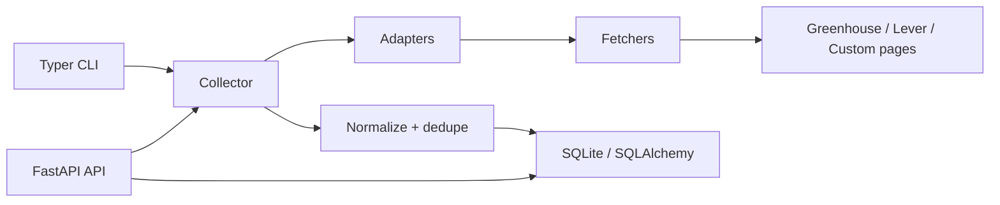

# Python Job Aggregator

A Python-first recruitment intelligence backend for collecting job postings from multiple sources, normalizing them into canonical records, deduplicating repeated listings, and exposing the result through a CLI and FastAPI API.

The project is intentionally backend-focused. It is designed to show a production-shaped crawler architecture without becoming a broad scraping framework or a frontend-heavy product.

## Current Status

This repository implements the full v1 showcase path:

- shared adapter contract and source adapters
- HTTP fetcher infrastructure with bounded retries and host-level rate limits
- Playwright browser fallback wrapper
- deterministic normalization and conservative deduplication
- SQLite persistence for jobs, crawl runs, crawl errors, and checkpoints
- collector orchestration with adapter failure isolation
- Typer CLI commands for local operations
- FastAPI query/admin API
- fixture-based tests that avoid live websites
- Docker, compose, Makefile, and documentation

## Capabilities

- Adapter-driven job collection for Greenhouse, Lever, configurable careers pages, and deterministic demo data
- HTTP-first fetching with Playwright browser fallback infrastructure
- Deterministic normalization and conservative deduplication
- SQLite persistence with SQLAlchemy and Alembic migration support
- Crawl run tracking, checkpointing, and recoverable error records
- FastAPI query endpoints for jobs, sources, and crawl runs
- Typer CLI commands for local operators
- Dockerized local development flow

## Planned Stack

- Python 3.12+
- FastAPI
- SQLAlchemy 2.x
- Alembic
- SQLite for local persistence
- httpx
- Playwright
- Pydantic and pydantic-settings
- Typer and Rich
- pytest and pytest-asyncio

## Quick Start

```bash
python -m venv .venv
.venv\Scripts\activate
python -m pip install -e ".[dev]"
python -m pytest
python -m job_aggregator.app.cli.main db init
python -m job_aggregator.app.cli.main db seed-demo
uvicorn job_aggregator.app.api.app:create_app --factory --reload
```

On macOS or Linux, activate the virtual environment with:

```bash
source .venv/bin/activate
```

## Project Layout

```text
job_aggregator/
  app/
    api/
      routes/
      schemas/
    core/
    crawler/
    adapters/
    fetchers/
    pipeline/
    db/
      migrations/
      repositories/
    services/
    cli/
tests/
docs/
scripts/
docker/
```

## Design Source

The product and architecture source of truth for the current engineering loop is:

- `2026-06-30-python-job-aggregator-design.md`

The same design material is also kept under:

- `docs/specs/2026-06-30-python-job-aggregator-design.md`

## Development Principles

- Keep crawler adapters isolated behind one shared contract.
- Keep fetch infrastructure separate from extraction logic.
- Store normalized canonical jobs, not only raw scraped blobs.
- Avoid live websites in default tests; use fixtures for adapter behavior.
- Treat browser automation as a fallback for rendering support, not as the default path.

## Architecture



See [docs/architecture.md](docs/architecture.md) for adapter design, crawl
lifecycle, data model, dedupe strategy, testing strategy, and scraping
guardrails.

## Adapter Contract

All source adapters inherit from `BaseJobAdapter` and return an `AdapterResult`.
The result carries `RawJobPosting` records plus recoverable `AdapterError` entries
so a future collector can isolate source failures without crashing the whole run.

Adapters also declare static metadata:

- `name`
- `fetch_mode`: `http`, `browser`, or `hybrid`
- `source_scope`: the source-specific unit the adapter knows how to crawl

The current Greenhouse, Lever, and custom page modules expose adapters with
this shared interface and fixture-tested parsers. `DemoAdapter` provides a
network-free local source for reviewer setup and API/CLI demos.

## Database

The v1 local database is SQLite, configured through `JOB_AGGREGATOR_DATABASE_URL`.
By default it writes to `./data/job_aggregator.db`.

Initialize the schema with:

```bash
job-aggregator db init
```

For one-off testing, the CLI also accepts an explicit URL:

```bash
python -m job_aggregator.app.cli.main db init --database-url sqlite:///:memory:
```

## CLI

```bash
python -m job_aggregator.app.cli.main crawl run
python -m job_aggregator.app.cli.main crawl run --adapter greenhouse --scope example --company "Example Inc"
python -m job_aggregator.app.cli.main jobs dedupe
python -m job_aggregator.app.cli.main jobs deactivate-stale --days 30
python -m job_aggregator.app.cli.main runs show
```

See [docs/cli.md](docs/cli.md) for more examples.

## API

```bash
curl http://localhost:8000/health
curl "http://localhost:8000/jobs?q=python&page=1&page_size=10"
curl http://localhost:8000/sources
curl http://localhost:8000/runs
curl -X POST http://localhost:8000/admin/crawl -H "Content-Type: application/json" -d "{\"adapters\":[\"demo\"]}"
```

OpenAPI docs are available at `/docs` when the API is running.

See [docs/api.md](docs/api.md) for endpoint examples.

## Docker

```bash
docker compose up --build
```

The API listens on `http://localhost:8000` and stores SQLite data under `./data`.
