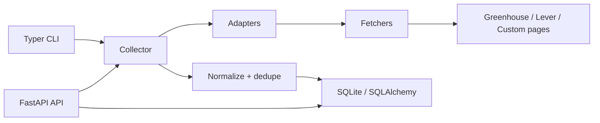

# Python Job Aggregator

Python Job Aggregator is a backend service for collecting job postings from
multiple hiring sources, normalizing them into canonical records, deduplicating
repeat listings, and exposing the data through an operator CLI and FastAPI API.

The project is designed as a production-shaped internal recruitment
intelligence tool. It focuses on crawler architecture, reliability, persistence,
and queryability rather than on a frontend shell.

## What It Does

- Collects jobs through adapter-based sources
- Supports Greenhouse, Lever, configurable careers pages, and local demo data
- Uses HTTP-first fetching with bounded retries and per-host rate limits
- Provides Playwright browser fallback infrastructure for rendered pages
- Normalizes raw postings into canonical job records
- Tracks crawl runs, errors, checkpoints, and run summaries
- Upserts repeat postings by source identity
- Generates conservative canonical fingerprints and cross-source dedupe candidates
- Exposes query endpoints through FastAPI and OpenAPI
- Provides local operator commands through Typer
- Applies schema changes through Alembic migrations
- Runs locally with SQLite, Docker, and fixture-backed tests

## Architecture



Core modules:

- `adapters`: source-specific job extraction behind one shared contract
- `fetchers`: reusable HTTP and browser acquisition infrastructure
- `pipeline`: normalization, salary parsing, tags, fingerprints, and dedupe
- `crawler`: crawl orchestration, checkpoints, adapter isolation, run summaries
- `db`: SQLAlchemy models, sessions, and repositories
- `api`: FastAPI app, schemas, routes, and admin crawl trigger
- `cli`: local operator commands

More detail is available in [docs/architecture.md](docs/architecture.md).

## Requirements

- Python 3.12+
- SQLite for local storage
- Optional Docker / Docker Compose

The Python package dependencies are declared in `pyproject.toml`.

## Quick Start

Windows PowerShell:

```powershell
python -m venv .venv
.\.venv\Scripts\activate
python -m pip install -e ".[dev]"
python -m pytest
python -m job_aggregator.app.cli.main db init
python -m job_aggregator.app.cli.main db seed-demo
uvicorn job_aggregator.app.api.app:create_app --factory --reload
```

macOS or Linux:

```bash
python -m venv .venv
source .venv/bin/activate
python -m pip install -e ".[dev]"
python -m pytest
python -m job_aggregator.app.cli.main db init
python -m job_aggregator.app.cli.main db seed-demo
uvicorn job_aggregator.app.api.app:create_app --factory --reload
```

The API will be available at:

- `http://127.0.0.1:8000`
- `http://127.0.0.1:8000/docs`
- `http://127.0.0.1:8000/openapi.json`

## Configuration

Configuration is read from environment variables. See `.env.example`.

Important settings:

```text
JOB_AGGREGATOR_ENV=local
JOB_AGGREGATOR_LOG_LEVEL=INFO
JOB_AGGREGATOR_DATABASE_URL=sqlite:///./data/job_aggregator.db
JOB_AGGREGATOR_HTTP_TIMEOUT_SECONDS=20
JOB_AGGREGATOR_HTTP_MAX_RETRIES=2
JOB_AGGREGATOR_HTTP_BACKOFF_SECONDS=0.5
JOB_AGGREGATOR_PER_HOST_CONCURRENCY=2
```

## CLI Usage

Apply database migrations:

```bash
python -m job_aggregator.app.cli.main db init
```

Load deterministic demo data:

```bash
python -m job_aggregator.app.cli.main db seed-demo
```

Run a local demo crawl:

```bash
python -m job_aggregator.app.cli.main crawl run
```

Run every locally configured CLI adapter. The default local set is `demo`:

```bash
python -m job_aggregator.app.cli.main crawl run --all
```

Run a Greenhouse board crawl:

```bash
python -m job_aggregator.app.cli.main crawl run \
  --adapter greenhouse \
  --scope example \
  --company "Example Inc"
```

Run a Lever company crawl:

```bash
python -m job_aggregator.app.cli.main crawl run \
  --adapter lever \
  --scope example \
  --company "Example Inc"
```

Inspect run summaries:

```bash
python -m job_aggregator.app.cli.main runs show
```

Resume from the adapters and latest checkpoints associated with a previous run:

```bash
python -m job_aggregator.app.cli.main crawl resume --run-id 1
```

Inspect cross-source dedupe candidates:

```bash
python -m job_aggregator.app.cli.main jobs dedupe
```

Deactivate stale jobs:

```bash
python -m job_aggregator.app.cli.main jobs deactivate-stale --days 30
```

Additional examples are in [docs/cli.md](docs/cli.md).

## API Usage

Health check:

```bash
curl http://127.0.0.1:8000/health
```

Trigger a demo crawl:

```bash
curl -X POST http://127.0.0.1:8000/admin/crawl \
  -H "Content-Type: application/json" \
  -d "{\"adapters\":[\"demo\"]}"
```

Trigger a configured Greenhouse crawl:

```bash
curl -X POST http://127.0.0.1:8000/admin/crawl \
  -H "Content-Type: application/json" \
  -d "{\"adapters\":[\"greenhouse\"],\"options\":{\"greenhouse\":{\"board_token\":\"example\",\"company_name\":\"Example Inc\"}}}"
```

List jobs:

```bash
curl "http://127.0.0.1:8000/jobs?page=1&page_size=10"
```

Filter jobs:

```bash
curl "http://127.0.0.1:8000/jobs?q=python"
curl "http://127.0.0.1:8000/jobs?location_type=remote&employment_type=full_time"
```

Inspect sources and runs:

```bash
curl http://127.0.0.1:8000/sources
curl http://127.0.0.1:8000/runs
curl http://127.0.0.1:8000/runs/1
curl http://127.0.0.1:8000/dedupe/candidates
```

More API examples are in [docs/api.md](docs/api.md).

## Docker

Build and run the API:

```bash
docker compose up --build
```

The container exposes `http://127.0.0.1:8000` and stores SQLite data under the
local `data/` directory.

## Testing

Run the full default test suite:

```bash
python -m ruff check .
python -m ruff format --check .
python -m pytest
python -m pytest --cov --cov-report=term-missing
```

The default tests avoid live websites. Adapter behavior is verified with stored
JSON and HTML fixtures, and HTTP behavior is tested with mocked transports.

## Project Layout

```text
job_aggregator/
  app/
    adapters/
    api/
    cli/
    core/
    crawler/
    db/
    fetchers/
    pipeline/
    services/
tests/
docs/
scripts/
```

## Responsible Collection

The crawler is intentionally HTTP-first, rate-limited, and bounded by retries
and timeouts. Browser automation is available as rendering support, not as a
bypass mechanism. The project avoids credentialed scraping, exploit behavior,
and claims of universal site coverage.
