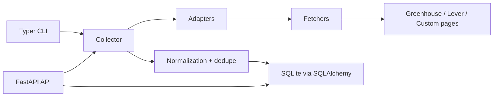

# Architecture

Python Job Aggregator is a backend-first recruitment intelligence service.

## Adapter Design

Every adapter inherits from `BaseJobAdapter` and returns `AdapterResult`.
Adapters emit `RawJobPosting` records and recoverable `AdapterError` records.
They never write to the database and they do not own normalization logic.

Current adapters:

- `DemoAdapter`: deterministic local sample data
- `GreenhouseAdapter`: parses Greenhouse board API JSON
- `LeverAdapter`: parses Lever postings API JSON
- `CustomPageAdapter`: parses simple configured static HTML pages

## Crawl Lifecycle

1. A CLI command or API request starts a collector run.
2. The collector creates a `CrawlRun` record.
3. Each selected adapter runs in isolation.
4. Adapter errors are stored as `CrawlRunError` records.
5. Raw jobs pass through normalization and dedupe.
6. Jobs are upserted by `source_name + source_job_id`.
7. Per-run adapter state records `adapter_name`, `scope_key`,
   `checkpoint_before`, and `checkpoint_after`.
8. Optional global checkpoints are persisted per adapter scope for new runs.
9. The run finishes as `success`, `partial_success`, or `failed`.

`crawl resume --run-id` resumes from the adapter state recorded for that specific
run, not from the newest global checkpoint.

## Data Model

The canonical `Job` table stores normalized job records with source identity,
canonical fingerprints, location/employment classifications, salary ranges,
timestamps, active state, and raw hashes.

Supporting tables:

- `crawl_runs`
- `crawl_run_adapter_states`
- `crawl_run_errors`
- `source_checkpoints`

Schema changes are applied through Alembic migrations in CLI and application
startup paths. Local tests can still explicitly use SQLAlchemy metadata
initialization for fast in-memory databases.

## Deduplication Strategy

Hard identity is `source_name + source_job_id`. This updates the same posting
across repeated crawls.

Soft identity is represented by `canonical_fingerprint`, generated from
normalized title, company, location, and source URL family. v1 avoids aggressive
fuzzy matching because silent bad merges are worse than conservative duplicates.

The operator-facing dedupe candidate query is read-only. It groups active jobs
across distinct sources when normalized title, company, and location match, then
returns a confidence score and reason for manual review.

Including inactive jobs is opt-in for review workflows. Candidate groups are not
automatic merge instructions and never mutate stored jobs.

## Testing Strategy

Default tests never depend on live websites. Source adapters are tested with
stored JSON/HTML fixtures. Fetcher tests use `httpx.MockTransport`, and API tests
use in-memory SQLite.

## Responsible Scraping Guardrails

The project is HTTP-first, rate-limited by host, and uses bounded retries.
Playwright exists as rendering fallback infrastructure, not as anti-bot bypass
machinery. The showcase intentionally avoids credentialed scraping, exploit
logic, and claims of universal scraping coverage.
